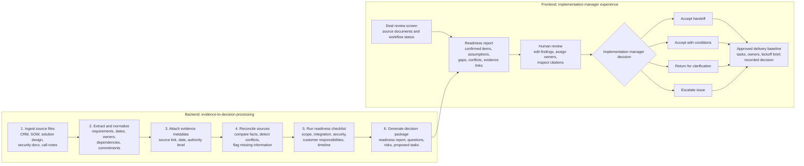

# Implementation Intelligence Workflow Architecture

## Purpose

This document defines the first demo: the Sales-to-Implementation Handoff Validator. It is a human-approved workflow that turns a closed-won deal room into an evidence-backed implementation-readiness decision.

## End-to-end workflow

## Backend responsibilities

1. Ingest a bounded source set: CRM record, executed order form/SOW, approved solution design, security requirements, customer implementation questionnaire, call summary, and handoff notes.
2. Extract a normalized fact model: requirement, deliverable, dependency, owner, date, integration, security constraint, success criterion, and unresolved question.
3. Store source citation, source date, and authority level with each extracted item.
4. Apply the source hierarchy: executed agreement, approved solution design, security/customer requirements, customer-approved plan, discovery calls, CRM, then informal handoff notes.
5. Compare extracted items across documents and against the implementation-readiness checklist.
6. Separate confirmed facts from assumptions and unresolved items; never silently resolve a conflict.
7. Generate the readiness report and a set of proposed clarification tasks.

## Frontend responsibilities

1. Show workflow status and the set of source materials reviewed.
2. Present a readiness report that groups findings by workstream.
3. Let the reviewer inspect source citations for every material assertion.
4. Let the reviewer edit findings, remove unsupported inference, assign owners, and mark questions for follow-up.
5. Require the implementation manager to choose a disposition: accept, accept with conditions, return, or escalate.
6. Generate a controlled output preview: approved baseline, clarification tasks, and internal kickoff brief.

## First-demo boundary

The demo uses synthetic documents and simulated downstream actions. It does not connect to a live CRM/project-management system, interpret contracts legally, automatically schedule resources, communicate with the customer, or autonomously start implementation.
